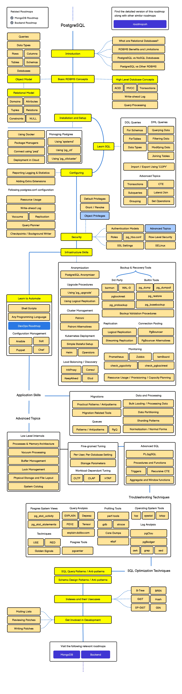

# PostgreSQL DBA Yol Haritası

<details>
<summary>🖼️ PostgreSQL DBA Roadmap Görselini Görüntüle</summary>


_PostgreSQL DBA Roadmap_

</details>

## İçindekiler

- [PostgreSQL Temelleri](#postgresql-temelleri)
- [Kurulum ve Yapılandırma](#kurulum-ve-yapılandırma)
- [Veritabanı Yönetimi](#veritabanı-yönetimi)
- [Kullanıcı ve Güvenlik Yönetimi](#kullanıcı-ve-güvenlik-yönetimi)
- [Performans İzleme ve Ayarlama](#performans-izleme-ve-ayarlama)
- [Yedekleme ve Kurtarma](#yedekleme-ve-kurtarma)
- [Replikasyon ve Yüksek Erişilebilirlik](#replikasyon-ve-yüksek-erişilebilirlik)
- [İzleme ve Logging](#izleme-ve-logging)
- [Bakım ve Optimizasyon](#bakım-ve-optimizasyon)
- [Gelişmiş Konular](#gelişmiş-konular)

---

## PostgreSQL Temelleri

<details>
<summary>📖 Detayı Görüntüle</summary>

### 1. Açıklama

PostgreSQL, açık kaynaklı, güçlü ve gelişmiş bir ilişkisel veritabanı yönetim sistemidir. ACID uyumlu, MVCC destekli ve SQL standartlarına uygun olarak geliştirilmiştir.

### 2. Amacı

- Güvenilir veri saklama ve yönetim
- Yüksek performanslı veri işleme
- Karmaşık veri tiplerini destekleme
- Ölçeklenebilir veritabanı çözümleri sunma

### 3. Özet

PostgreSQL "The World's Most Advanced Open Source Relational Database" sloganıyla bilinir. JSON, XML, Arrays gibi modern veri tiplerini destekler.

### 4. Basit Açıklama

PostgreSQL'i bir süper gelişmiş kütüphane sistemi olarak düşünün. Sadece kitapları değil, resimler, videolar, haritalar gibi her türlü bilgiyi organize ederek saklayabiliyor.

### 5. Bu terim neden gerekli?

- Enterprise düzeyinde güvenilirlik
- Açık kaynak olması (maliyet avantajı)
- Gelişmiş özellikler (JSON, GIS, Full-text search)
- Büyük topluluğa sahip olması

### 6. Örnek

```bash
# PostgreSQL version kontrolü
postgres=# SELECT version();

# Veritabanı listesi
postgres=# \l

# Aktif bağlantıları görme
postgres=# SELECT * FROM pg_stat_activity;

# Tablo boyutlarını görme
postgres=# SELECT
    schemaname,
    tablename,
    pg_size_pretty(pg_total_relation_size(schemaname||'.'||tablename)) as size
FROM pg_tables
ORDER BY pg_total_relation_size(schemaname||'.'||tablename) DESC;
```

### 7. Ezberleme Tekniği

**Gerçek Hayat Örneği**: PostgreSQL'i bir üniversite kütüphanesi olarak düşünün. Sadece kitap değil, tez arşivi, dijital koleksiyon, harita koleksiyonu da var. Her türlü akademik ihtiyacı karşılayabilir.

**Hafıza Hilesi**:

- **PostgreSQL** = **POST-GRES-QL** (Post = Sonra, Gres = Ingres veritabanından sonra, QL = Query Language)
- **ACID** = **Atomicity, Consistency, Isolation, Durability** (Veritabanının temel özellikleri)
- **MVCC** = **Multi-Version Concurrency Control** (Çoklu versiyon eşzamanlılık kontrolü)

</details>

---

## Kurulum ve Yapılandırma

<details>
<summary>📖 Detayı Görüntüle</summary>

### 1. Açıklama

PostgreSQL'in farklı işletim sistemlerinde kurulumu, temel yapılandırma dosyalarının düzenlenmesi ve initial setup işlemlerini kapsar.

### 2. Amacı

- PostgreSQL'i sistem gereksinimlerine göre kurma
- Güvenlik ayarlarını yapılandırma
- Performans için initial tuning
- Cluster oluşturma ve başlatma

### 3. Özet

postgresql.conf, pg_hba.conf gibi temel dosyaların yapılandırılması, initdb ile cluster oluşturma, service management konularını içerir.

### 4. Basit Açıklama

Bir ev kurarmış gibi. Önce temeli atıyorsunuz (kurulum), sonra elektrik su tesisatını bağlıyorsunuz (yapılandırma), en son güvenlik sistemini kuruyorsunuz.

### 5. Bu terim neden gerekli?

- Production ortamında doğru kurulum kritik
- Güvenlik açıklarını önlemek için
- Performans optimizasyonu için
- Backup stratejisi için

### 6. Örnek

```bash
# Ubuntu'da PostgreSQL kurulumu
sudo apt update
sudo apt install postgresql postgresql-contrib

# PostgreSQL service kontrolü
sudo systemctl start postgresql
sudo systemctl enable postgresql
sudo systemctl status postgresql

# PostgreSQL kullanıcısına geçiş
sudo -i -u postgres

# psql ile bağlanma
psql

# Yeni kullanıcı oluşturma
postgres=# CREATE USER myuser WITH PASSWORD 'mypassword';

# Yeni veritabanı oluşturma
postgres=# CREATE DATABASE mydatabase OWNER myuser;

# postgresql.conf önemli ayarları
# listen_addresses = 'localhost'        # Dinlenecek IP adresleri
# port = 5432                          # Port numarası
# max_connections = 100                # Maksimum bağlantı sayısı
# shared_buffers = 128MB               # Paylaşılan buffer boyutu
# work_mem = 4MB                       # Sort ve hash için bellek

# pg_hba.conf örnek ayarı
# TYPE  DATABASE        USER            ADDRESS                 METHOD
# local   all             all                                     trust
# host    all             all             127.0.0.1/32            md5
# host    all             all             ::1/128                 md5
```

### 7. Ezberleme Tekniği

**Gerçek Hayat Örneği**: Bir fabrika kurmak gibi. Önce arsayı hazırlıyorsunuz (initdb), sonra elektrik su bağlıyorsunuz (postgresql.conf), güvenlik sistemini kuruyorsunuz (pg_hba.conf), işçileri işe alıyorsunuz (kullanıcı oluşturma).

**Hafıza Hilesi**:

- **initdb** = **INITIALIZE DATABASE** (veritabanını başlat)
- **postgresql.conf** = **POSTGRE AYARLARI** (motor ayarları)
- **pg_hba.conf** = **HOST BASED AUTHENTICATION** (kim nereden bağlanabilir)

</details>

---

## Veritabanı Yönetimi

<details>
<summary>📖 Detayı Görüntüle</summary>

### 1. Açıklama

Veritabanı oluşturma, silme, değiştirme, tablespace yönetimi, schema organizasyonu gibi temel veritabanı yönetim işlemlerini kapsar.

### 2. Amacı

- Veritabanı lifecycle management
- Storage yönetimi ve optimizasyonu
- Schema organizasyonu
- Metadata yönetimi

### 3. Özet

CREATE DATABASE, DROP DATABASE, ALTER DATABASE komutları, tablespace kullanımı, vacuum ve analyze işlemleri, statistics güncelleme konularını içerir.

### 4. Basit Açıklama

Bir şirket binasını yönetmek gibi. Yeni departmanlar oluşturmak (database), eski departmanları kapatmak, dosya dolapslarını organize etmek (tablespace).

### 5. Bu terim neden gerekli?

- Efficient storage kullanımı için
- Performance optimization için
- Data organization için
- Maintenance operasyonları için

### 6. Örnek

```sql
-- Veritabanı oluşturma
CREATE DATABASE ecommerce
    WITH
    OWNER = ecommerce_user
    ENCODING = 'UTF8'
    LC_COLLATE = 'en_US.UTF-8'
    LC_CTYPE = 'en_US.UTF-8'
    TABLESPACE = pg_default
    CONNECTION LIMIT = 100;

-- Tablespace oluşturma
CREATE TABLESPACE fast_storage
LOCATION '/mnt/ssd/postgresql';

-- Veritabanı bilgilerini görme
SELECT
    datname as database_name,
    pg_size_pretty(pg_database_size(datname)) as size,
    datconnlimit as connection_limit
FROM pg_database
WHERE datistemplate = false;

-- Schema oluşturma
CREATE SCHEMA sales;
CREATE SCHEMA inventory;

-- Vacuum ve Analyze
VACUUM VERBOSE ANALYZE customers;

-- Otomatik vacuum ayarları
ALTER TABLE customers SET (
    autovacuum_vacuum_threshold = 1000,
    autovacuum_analyze_threshold = 500
);

-- Database statistics
SELECT
    schemaname,
    tablename,
    attname,
    null_frac,
    avg_width,
    n_distinct,
    most_common_vals
FROM pg_stats
WHERE tablename = 'customers';
```

### 7. Ezberleme Tekniği

**Gerçek Hayat Örneği**: Bir AVM yönetmek gibi. Yeni mağazalar açıyorsunuz (CREATE DATABASE), eski mağazaları kapatıyorsunuz (DROP), düzenli temizlik yapıyorsunuz (VACUUM), müşteri trafiğini analiz ediyorsunuz (ANALYZE).

**Hafıza Hilesi**:

- **VACUUM** = **SÜPÜRGE** (çöpleri temizle)
- **ANALYZE** = **ANALİZ ET** (istatistikleri güncelle)
- **TABLESPACE** = **TABLO ALANI** (fiziksel depolama yeri)

</details>

---

## Kullanıcı ve Güvenlik Yönetimi

<details>
<summary>📖 Detayı Görüntüle</summary>

### 1. Açıklama

PostgreSQL'de kullanıcı oluşturma, rol yönetimi, izin verme, güvenlik politikaları belirleme ve authentication yöntemlerini yönetme işlemlerini kapsar.

### 2. Amacı

- Veri güvenliğini sağlama
- Kullanıcı erişim kontrolü
- Role-based access control (RBAC)
- Audit trail oluşturma

### 3. Özet

CREATE ROLE, GRANT/REVOKE komutları, Row Level Security (RLS), SSL yapılandırması, password policies konularını içerir.

### 4. Basit Açıklama

Bir şirketin güvenlik sistemi gibi. Kimlik kartları veriyorsunuz (kullanıcı oluşturma), hangi katlara çıkabileceklerini belirliyorsunuz (izin verme), güvenlik kameralarını izliyorsunuz (audit).

### 5. Bu terim neden gerekli?

- Veri ihlallerini önlemek için
- Compliance gereksinimleri için
- Least privilege principle için
- Audit requirements için

### 6. Örnek

```sql
-- Rol oluşturma
CREATE ROLE developers;
CREATE ROLE analysts;
CREATE ROLE app_users;

-- Kullanıcı oluşturma
CREATE USER john_doe WITH PASSWORD 'secure_password'
    VALID UNTIL '2024-12-31'
    CONNECTION LIMIT 5;

-- Rol atama
GRANT developers TO john_doe;

-- Veritabanı seviyesinde izin
GRANT CONNECT, CREATE ON DATABASE ecommerce TO developers;

-- Schema seviyesinde izin
GRANT USAGE, CREATE ON SCHEMA sales TO developers;

-- Tablo seviyesinde izin
GRANT SELECT, INSERT, UPDATE ON sales.orders TO app_users;
GRANT SELECT ON sales.customers TO analysts;

-- Column seviyesinde izin
GRANT SELECT (customer_name, email) ON sales.customers TO support_team;

-- Row Level Security (RLS) aktifleştirme
ALTER TABLE sales.orders ENABLE ROW LEVEL SECURITY;

-- RLS policy oluşturma
CREATE POLICY sales_policy ON sales.orders
    FOR ALL TO sales_team
    USING (sales_rep_id = current_user_id());

-- SSL zorunlu hale getirme
ALTER USER john_doe SET ssl TO 'on';

-- Password policy
ALTER ROLE john_doe PASSWORD 'new_password' VALID UNTIL '2024-12-31';

-- Kullanıcı aktivitelerini görme
SELECT
    usename,
    application_name,
    client_addr,
    backend_start,
    query_start,
    state,
    query
FROM pg_stat_activity
WHERE state = 'active';
```

### 7. Ezberleme Tekniği

**Gerçek Hayat Örneği**: Bir hastane güvenlik sistemi gibi. Doktorlara hasta dosyalarına erişim (GRANT), hemşirelere sadece okuma izni, güvenlik görevlisine sadece giriş çıkış kayıtları. Her kişinin görevine göre farklı yetkiler.

**Hafıza Hilesi**:

- **GRANT** = **VER** (izin ver)
- **REVOKE** = **GERİ AL** (izni geri al)
- **ROLE** = **ROL** (görev tanımı)
- **RLS** = **ROW LEVEL SECURITY** (satır seviyesi güvenlik)

</details>

---

## Performans İzleme ve Ayarlama

<details>
<summary>📖 Detayı Görüntüle</summary>

### 1. Açıklama

PostgreSQL'in performansını izleme, bottleneck'leri tespit etme, query optimization, index tuning ve sistem kaynaklarını verimli kullanma konularını kapsar.

### 2. Amacı

- Sistem performansını optimize etme
- Slow queries'i tespit etme
- Resource utilization'ı iyileştirme
- Capacity planning yapma

### 3. Özet

pg*stat*\* views, EXPLAIN ANALYZE, pg_stat_statements, performance tuning parameters, index optimization konularını içerir.

### 4. Basit Açıklama

Bir arabanın motor performansını izlemek gibi. Yakıt tüketimini, motor devir sayısını, fren performansını sürekli kontrol edip gerektiğinde ayar yapıyorsunuz.

### 5. Bu terim neden gerekli?

- Kullanıcı deneyimi için kritik
- Sistem kaynaklarını verimli kullanmak için
- Maliyetleri optimize etmek için
- SLA gereksinimlerini karşılamak için

### 6. Örnek

```sql
-- pg_stat_statements extension'ını aktifleştirme
CREATE EXTENSION IF NOT EXISTS pg_stat_statements;

-- En yavaş sorguları bulma
SELECT
    query,
    calls,
    total_time,
    mean_time,
    rows
FROM pg_stat_statements
ORDER BY total_time DESC
LIMIT 10;

-- Veritabanı istatistikleri
SELECT
    datname,
    numbackends,
    xact_commit,
    xact_rollback,
    blks_read,
    blks_hit,
    tup_returned,
    tup_fetched
FROM pg_stat_database;

-- Tablo istatistikleri
SELECT
    schemaname,
    tablename,
    seq_scan,
    seq_tup_read,
    idx_scan,
    idx_tup_fetch,
    n_tup_ins,
    n_tup_upd,
    n_tup_del
FROM pg_stat_user_tables
ORDER BY seq_scan DESC;

-- Index kullanım istatistikleri
SELECT
    schemaname,
    tablename,
    indexname,
    idx_scan,
    idx_tup_read,
    idx_tup_fetch
FROM pg_stat_user_indexes
WHERE idx_scan = 0;  -- Kullanılmayan indexler

-- Sorgu planını analiz etme
EXPLAIN (ANALYZE, BUFFERS, VERBOSE)
SELECT c.name, COUNT(o.id) as order_count
FROM customers c
LEFT JOIN orders o ON c.id = o.customer_id
GROUP BY c.id, c.name
HAVING COUNT(o.id) > 5;

-- Gerçek zamanlı aktivite
SELECT
    pid,
    usename,
    application_name,
    client_addr,
    backend_start,
    query_start,
    state_change,
    state,
    LEFT(query, 50) as current_query
FROM pg_stat_activity
WHERE state != 'idle'
ORDER BY query_start;

-- Buffer cache hit ratio
SELECT
    datname,
    round(blks_hit*100.0/(blks_hit+blks_read), 2) as hit_ratio
FROM pg_stat_database
WHERE blks_read > 0;

-- Lock monitoring
SELECT
    pl.pid,
    pa.usename,
    pa.application_name,
    pl.mode,
    pl.locktype,
    pl.relation::regclass,
    pa.query
FROM pg_locks pl
JOIN pg_stat_activity pa ON pl.pid = pa.pid
WHERE NOT pl.granted;
```

### 7. Ezberleme Tekniği

**Gerçek Hayat Örneği**: Bir fabrikadaki kalite kontrol sistemi gibi. Üretim hızını (throughput), hata oranlarını (error rates), makine verimliliklerini (resource utilization) sürekli izliyorsunuz.

**Hafıza Hilesi**:

- **pg_stat_statements** = **İFADE İSTATİSTİKLERİ** (hangi sorgu ne kadar çalıştı)
- **EXPLAIN ANALYZE** = **AÇIKLA VE ANALİZ ET** (sorgunun nasıl çalıştığını göster)
- **Buffer Cache Hit Ratio** = **ÖNBELLEK İSABET ORANI** (veriye diskten mi bellekten mi erişiliyor)

</details>

---

## Yedekleme ve Kurtarma

<details>
<summary>📖 Detayı Görüntüle</summary>

### 1. Açıklama

PostgreSQL veritabanlarının yedeğini alma, geri yükleme, disaster recovery planları oluşturma ve Point-in-Time Recovery (PITR) işlemlerini kapsar.

### 2. Amacı

- Veri kaybını önleme
- Business continuity sağlama
- Disaster recovery planı oluşturma
- Compliance gereksinimlerini karşılama

### 3. Özet

pg_dump, pg_restore, pg_basebackup, WAL archiving, PITR, continuous archiving konularını içerir.

### 4. Basit Açıklama

Önemli belgelerinizin fotokopisini çekmek gibi. Bilgisayar bozulduğunda veya dosyalar silindiğinde kopyalardan geri getirebiliyorsunuz.

### 5. Bu terim neden gerekli?

- Veri kaybı durumunda kurtarma için
- Regulatory compliance için
- Business continuity için
- Testing ve development için

### 6. Örnek

```bash
# Logical backup - pg_dump
pg_dump -h localhost -U postgres -d ecommerce > ecommerce_backup.sql

# Compressed backup
pg_dump -h localhost -U postgres -d ecommerce | gzip > ecommerce_backup.sql.gz

# Custom format backup
pg_dump -h localhost -U postgres -Fc -d ecommerce -f ecommerce_backup.dump

# Parallel backup (faster)
pg_dump -h localhost -U postgres -Fd -j 4 -d ecommerce -f backup_directory/

# Physical backup - pg_basebackup
pg_basebackup -h localhost -U replication -D /backup/base -Ft -z -P

# WAL archiving için postgresql.conf ayarları
# wal_level = replica
# archive_mode = on
# archive_command = 'cp %p /backup/wal_archive/%f'

# Restore işlemleri
# SQL backup'tan restore
psql -h localhost -U postgres -d ecommerce_new < ecommerce_backup.sql

# Custom format'tan restore
pg_restore -h localhost -U postgres -d ecommerce_new ecommerce_backup.dump

# Parallel restore
pg_restore -h localhost -U postgres -d ecommerce_new -j 4 backup_directory/

# Point-in-Time Recovery (PITR)
# recovery.conf dosyası oluşturma
echo "restore_command = 'cp /backup/wal_archive/%f %p'" > recovery.conf
echo "recovery_target_time = '2023-12-01 14:30:00'" >> recovery.conf

# Automated backup script örneği
#!/bin/bash
BACKUP_DIR="/backup"
DATE=$(date +"%Y%m%d_%H%M%S")
DATABASE="ecommerce"

# Backup oluşturma
pg_dump -h localhost -U postgres -Fc $DATABASE > $BACKUP_DIR/backup_${DATABASE}_${DATE}.dump

# Eski backup'ları temizleme (7 günden eski)
find $BACKUP_DIR -name "backup_${DATABASE}_*.dump" -mtime +7 -delete

# Backup doğrulama
pg_restore --list $BACKUP_DIR/backup_${DATABASE}_${DATE}.dump > /dev/null
if [ $? -eq 0 ]; then
    echo "Backup successful: backup_${DATABASE}_${DATE}.dump"
else
    echo "Backup failed!"
    exit 1
fi
```

### 7. Ezberleme Tekniği

**Gerçek Hayat Örneği**: Fotoğraflarınızı hem bilgisayarda, hem bulutta, hem de harici diskte saklıyorsunuz. Biri bozulunca diğerinden geri getiriyorsunuz.

**Hafıza Hilesi**:

- **pg_dump** = **POSTGRESQL DUMP** (veritabanını dökümle)
- **pg_restore** = **POSTGRESQL RESTORE** (geri yükle)
- **PITR** = **POINT IN TIME RECOVERY** (belirli zaman noktasına geri dön)
- **WAL** = **WRITE AHEAD LOG** (işlemleri önceden kaydet)

</details>

---

## Replikasyon ve Yüksek Erişilebilirlik

<details>
<summary>📖 Detayı Görüntüle</summary>

### 1. Açıklama

PostgreSQL'de master-slave replikasyon, streaming replication, logical replication ve high availability cluster kurulumları konularını kapsar.

### 2. Amacı

- System uptime'ı maksimize etme
- Load distribution sağlama
- Disaster recovery için standby sistemler
- Geographic data distribution

### 3. Özet

Streaming replication, logical replication, hot standby, failover/failback işlemleri, connection pooling konularını içerir.

### 4. Basit Açıklama

Önemli bir belgeyi birden fazla ofiste aynı anda bulundurmak gibi. Bir ofis kapanırsa diğerinden devam edebiliyorsunuz.

### 5. Bu terim neden gerekli?

- 24/7 sistem uptime için
- Performance scaling için
- Geographic distribution için
- Disaster recovery için

### 6. Örnek

```bash
# Master sunucuda replication kullanıcısı oluşturma
psql -U postgres
CREATE ROLE replication WITH REPLICATION LOGIN PASSWORD 'replication_password';

# postgresql.conf'da replication ayarları (Master)
# wal_level = replica
# max_wal_senders = 3
# wal_keep_segments = 32
# synchronous_standby_names = 'standby1'

# pg_hba.conf'da replication ayarı (Master)
# host replication replication 192.168.1.100/32 md5

# Standby sunucuyu hazırlama
pg_basebackup -h master_server -D /var/lib/postgresql/data -U replication -P -W

# recovery.conf oluşturma (Standby)
echo "standby_mode = 'on'" > recovery.conf
echo "primary_conninfo = 'host=master_server port=5432 user=replication password=replication_password'" >> recovery.conf
echo "trigger_file = '/tmp/postgresql.trigger'" >> recovery.conf

# Replication durumunu kontrol etme (Master)
SELECT
    client_addr,
    state,
    sent_lsn,
    write_lsn,
    flush_lsn,
    replay_lsn,
    sync_state
FROM pg_stat_replication;

# Standby durumunu kontrol etme (Standby)
SELECT pg_is_in_recovery();
SELECT pg_last_wal_receive_lsn(), pg_last_wal_replay_lsn();

# Logical Replication örneği
# Publisher (Source database)
CREATE PUBLICATION my_publication FOR TABLE users, orders;

# Subscriber (Target database)
CREATE SUBSCRIPTION my_subscription
CONNECTION 'host=source_host dbname=source_db user=replication_user password=password'
PUBLICATION my_publication;

# Failover işlemi (Standby'yi promote etme)
pg_ctl promote -D /var/lib/postgresql/data

# Connection Pooling (PgBouncer) yapılandırması
# pgbouncer.ini
[databases]
ecommerce = host=postgresql_server port=5432 dbname=ecommerce

[pgbouncer]
listen_port = 6432
listen_addr = *
auth_type = md5
auth_file = userlist.txt
pool_mode = transaction
max_client_conn = 1000
default_pool_size = 25
```

### 7. Ezberleme Tekniği

**Gerçek Hayat Örneği**: Büyük bir şirketin merkez ofisi ve şube ofisleri gibi. Merkez ofisten şubelere sürekli güncel bilgiler gönderiliyor. Merkez ofis kapanırsa, şubelerden biri merkez oluyor.

**Hafıza Hilesi**:

- **REPLICATION** = **KOPYALAMA** (verileri kopyala)
- **MASTER** = **ANA SUNUCU** (asıl veri burada)
- **STANDBY** = **YEDEK SUNUCU** (kopya veri burada)
- **FAILOVER** = **BAŞKA SUNUCUYA GEÇİŞ** (ana sunucu bozulunca yedek devralır)

</details>

---

## İzleme ve Logging

<details>
<summary>📖 Detayı Görüntüle</summary>

### 1. Açıklama

PostgreSQL'in log yapılandırması, monitoring tools, alerting sistemleri ve performans metrikleri izleme konularını kapsar.

### 2. Amacı

- Sistem sağlığını sürekli izleme
- Proactive problem detection
- Audit trail oluşturma
- Capacity planning için veri toplama

### 3. Özet

Log configuration, pg*stat*\* views, external monitoring tools (Prometheus, Grafana), log analysis konularını içerir.

### 4. Basit Açıklama

Bir hastanenin hasta takip sistemi gibi. Sürekli vital signs izleniyor, anormal bir durum olduğunda alarm çalıyor.

### 5. Bu terim neden gerekli?

- Erken uyarı sistemi için
- Root cause analysis için
- Performance optimization için
- Security monitoring için

### 6. Örnek

```sql
-- postgresql.conf'da logging ayarları
# log_destination = 'stderr,csvlog'
# logging_collector = on
# log_directory = 'log'
# log_filename = 'postgresql-%Y-%m-%d_%H%M%S.log'
# log_rotation_age = 1d
# log_rotation_size = 100MB
# log_min_duration_statement = 1000  # 1 saniyeden uzun sorguları logla
# log_line_prefix = '%t [%p-%l] %q%u@%d '
# log_checkpoints = on
# log_connections = on
# log_disconnections = on
# log_lock_waits = on
# log_statement = 'ddl'  # DDL statements'ları logla

-- Aktif bağlantıları izleme
SELECT
    datname,
    usename,
    application_name,
    client_addr,
    backend_start,
    state,
    query_start,
    LEFT(query, 50) as current_query
FROM pg_stat_activity
WHERE state != 'idle'
ORDER BY backend_start;

-- Slow queries'i izleme
SELECT
    query,
    calls,
    total_time/1000 as total_time_seconds,
    mean_time/1000 as mean_time_seconds,
    rows,
    100.0 * shared_blks_hit / nullif(shared_blks_hit + shared_blks_read, 0) AS hit_percent
FROM pg_stat_statements
WHERE total_time > 60000  -- 1 dakikadan uzun toplam süre
ORDER BY total_time DESC;

-- Database size monitoring
SELECT
    datname,
    pg_size_pretty(pg_database_size(datname)) as size,
    pg_database_size(datname) as size_bytes
FROM pg_database
ORDER BY pg_database_size(datname) DESC;

-- Table growth monitoring
SELECT
    schemaname,
    tablename,
    pg_size_pretty(pg_total_relation_size(schemaname||'.'||tablename)) as total_size,
    pg_size_pretty(pg_relation_size(schemaname||'.'||tablename)) as table_size,
    pg_size_pretty(pg_indexes_size(schemaname||'.'||tablename)) as indexes_size
FROM pg_tables
ORDER BY pg_total_relation_size(schemaname||'.'||tablename) DESC
LIMIT 10;

-- Lock monitoring
SELECT
    pl.pid,
    pa.usename,
    pa.application_name,
    pl.mode,
    pl.locktype,
    pl.relation::regclass as table_name,
    pa.query_start,
    now() - pa.query_start as duration
FROM pg_locks pl
JOIN pg_stat_activity pa ON pl.pid = pa.pid
WHERE NOT pl.granted
ORDER BY pa.query_start;

-- Custom monitoring function
CREATE OR REPLACE FUNCTION get_db_health_report()
RETURNS TABLE (
    metric_name text,
    metric_value text,
    status text
) AS $$
BEGIN
    RETURN QUERY
    SELECT
        'Active Connections'::text,
        count(*)::text,
        CASE
            WHEN count(*) > 80 THEN 'WARNING'
            WHEN count(*) > 95 THEN 'CRITICAL'
            ELSE 'OK'
        END
    FROM pg_stat_activity
    WHERE state != 'idle'

    UNION ALL

    SELECT
        'Buffer Cache Hit Ratio'::text,
        round(sum(blks_hit)*100.0/sum(blks_hit+blks_read), 2)::text || '%',
        CASE
            WHEN round(sum(blks_hit)*100.0/sum(blks_hit+blks_read), 2) < 90 THEN 'WARNING'
            WHEN round(sum(blks_hit)*100.0/sum(blks_hit+blks_read), 2) < 80 THEN 'CRITICAL'
            ELSE 'OK'
        END
    FROM pg_stat_database
    WHERE blks_read > 0;
END;
$$ LANGUAGE plpgsql;

-- Monitoring function'ı çalıştırma
SELECT * FROM get_db_health_report();
```

### 7. Ezberleme Tekniği

**Gerçek Hayat Örneği**: Bir arabanın dashboard'u gibi. Yakıt seviyesi, motor sıcaklığı, hız göstergesi sürekli görünüyor. Kırmızı ışık yanınca sorun var demek.

**Hafıza Hilesi**:

- **MONITORING** = **İZLEME** (sürekli kontrol et)
- **LOGGING** = **GÜNLÜK TUTMA** (her şeyi kaydet)
- **ALERT** = **UYARI** (problem olunca haber ver)
- **METRICS** = **ÖLÇÜMLER** (sayısal veriler)

</details>

---

## Bakım ve Optimizasyon

<details>
<summary>📖 Detayı Görüntüle</summary>

### 1. Açıklama

PostgreSQL veritabanının düzenli bakım işlemleri, VACUUM, ANALYZE, REINDEX işlemleri ve genel optimizasyon tekniklerini kapsar.

### 2. Amacı

- Veritabanı performansını koruma
- Disk alanını verimli kullanma
- Statistics'leri güncel tutma
- Dead tuple'ları temizleme

### 3. Özet

Manual ve automatic vacuum, analyze operations, reindex işlemleri, table partitioning, configuration tuning konularını içerir.

### 4. Basit Açıklama

Bir arabanın periyodik bakımı gibi. Yağ değişimi (VACUUM), lastik basıncı kontrolü (ANALYZE), motor ayarı (tuning) yapıyorsunuz.

### 5. Bu terim neden gerekli?

- Performance degradation'ı önlemek için
- Disk space'i optimize etmek için
- Query planner için güncel statistics
- System stability için

### 6. Örnek

```sql
-- Manual VACUUM operations
VACUUM VERBOSE customers;           -- Dead tuples'ları temizle
VACUUM FULL customers;              -- Tablo tamamen yeniden düzenle
VACUUM ANALYZE customers;           -- Temizle ve statistics güncelle

-- ANALYZE operations
ANALYZE customers;                  -- Statistics güncelle
ANALYZE VERBOSE customers;          -- Detaylı çıktı ile statistics güncelle

-- REINDEX operations
REINDEX TABLE customers;            -- Tablo index'lerini yeniden oluştur
REINDEX INDEX idx_customer_email;   -- Specific index'i yeniden oluştur
REINDEX DATABASE ecommerce;         -- Tüm database index'lerini yeniden oluştur

-- Autovacuum ayarları (postgresql.conf)
# autovacuum = on
# autovacuum_max_workers = 3
# autovacuum_naptime = 1min
# autovacuum_vacuum_threshold = 50
# autovacuum_analyze_threshold = 50
# autovacuum_vacuum_scale_factor = 0.2
# autovacuum_analyze_scale_factor = 0.1

-- Table-specific autovacuum ayarları
ALTER TABLE orders SET (
    autovacuum_vacuum_threshold = 1000,
    autovacuum_vacuum_scale_factor = 0.1,
    autovacuum_analyze_threshold = 500,
    autovacuum_analyze_scale_factor = 0.05
);

-- Bloat monitoring (table bloat)
SELECT
    schemaname,
    tablename,
    pg_size_pretty(pg_total_relation_size(schemaname||'.'||tablename)) as total_size,
    pg_size_pretty(pg_relation_size(schemaname||'.'||tablename)) as table_size,
    round(100 * pg_relation_size(schemaname||'.'||tablename) / pg_total_relation_size(schemaname||'.'||tablename)) as table_percent
FROM pg_tables
WHERE schemaname = 'public'
ORDER BY pg_total_relation_size(schemaname||'.'||tablename) DESC;

-- Index bloat monitoring
SELECT
    schemaname,
    tablename,
    indexname,
    pg_size_pretty(pg_relation_size(indexname::regclass)) as index_size,
    idx_scan,
    idx_tup_read,
    idx_tup_fetch
FROM pg_stat_user_indexes
ORDER BY pg_relation_size(indexname::regclass) DESC;

-- Table partitioning örneği
-- Parent table
CREATE TABLE orders_partitioned (
    id SERIAL,
    customer_id INTEGER,
    order_date DATE,
    total_amount DECIMAL(10,2)
) PARTITION BY RANGE (order_date);

-- Child partitions
CREATE TABLE orders_2023_q1 PARTITION OF orders_partitioned
    FOR VALUES FROM ('2023-01-01') TO ('2023-04-01');

CREATE TABLE orders_2023_q2 PARTITION OF orders_partitioned
    FOR VALUES FROM ('2023-04-01') TO ('2023-07-01');

-- Configuration tuning örneği
-- Memory settings
# shared_buffers = 256MB                    # 25% of RAM
# effective_cache_size = 1GB                # 75% of RAM
# work_mem = 16MB                           # RAM / max_connections
# maintenance_work_mem = 64MB               # For maintenance operations

-- Connection settings
# max_connections = 100
# superuser_reserved_connections = 3

-- WAL settings
# wal_buffers = 16MB
# checkpoint_completion_target = 0.7
# wal_writer_delay = 200ms

-- Query planner settings
# random_page_cost = 1.1                    # For SSD
# effective_io_concurrency = 200            # For SSD

-- Maintenance script örneği
#!/bin/bash
DB_NAME="ecommerce"
THRESHOLD_DAYS=7

# Dead tuples oranı yüksek tabloları bul ve vacuum yap
psql -d $DB_NAME -c "
SELECT
    schemaname||'.'||tablename as full_table_name,
    n_dead_tup,
    n_live_tup,
    round(n_dead_tup * 100.0 / (n_live_tup + n_dead_tup), 2) as dead_percentage
FROM pg_stat_user_tables
WHERE n_dead_tup > 1000
AND n_dead_tup * 100.0 / (n_live_tup + n_dead_tup) > 10
ORDER BY dead_percentage DESC;
" | while read table_name rest; do
    if [ "$table_name" != "full_table_name" ] && [ "$table_name" != "" ]; then
        echo "Vacuuming $table_name..."
        psql -d $DB_NAME -c "VACUUM ANALYZE $table_name;"
    fi
done
```

### 7. Ezberleme Tekniği

**Gerçek Hayat Örneği**: Ev temizliği yapmak gibi. Düzenli olarak süpürüp paspas çekiyorsunuz (VACUUM), eşyaları düzenliyorsunuz (ANALYZE), gerektiğinde tadilat yapıyorsunuz (REINDEX).

**Hafıza Hilesi**:

- **VACUUM** = **SÜPÜRGE** (ölü verileri temizle)
- **ANALYZE** = **ANALİZ** (istatistikleri güncelle)
- **REINDEX** = **YENİDEN İNDEXLE** (index'leri yeniden oluştur)
- **AUTOVACUUM** = **OTOMATİK SÜPÜRGE** (kendiliğinden temizlik)

</details>

---

## Gelişmiş Konular

<details>
<summary>📖 Detayı Görüntüle</summary>

### 1. Açıklama

PostgreSQL'in gelişmiş özelliklerini kapsar: Extensions, Custom data types, PL/pgSQL programming, Foreign Data Wrappers, JSON/JSONB operations.

### 2. Amacı

- PostgreSQL'in tüm potansiyelini kullanma
- Complex business logic implementation
- Integration with external systems
- Modern application requirements

### 3. Özet

Extensions (PostGIS, pgcrypto), PL/pgSQL, FDW, JSON operations, full-text search, parallel processing konularını içerir.

### 4. Basit Açıklama

Bir akıllı telefonun gelişmiş özelliklerini kullanmak gibi. Sadece arama yapmakla kalmayıp, GPS, kamera, uygulamalar gibi özelliklerden de faydalanıyorsunuz.

### 5. Bu terim neden gerekli?

- Complex requirements için
- Modern application development için
- External system integration için
- PostgreSQL'i tam kapasite kullanmak için

### 6. Örnek

```sql
-- Extensions
-- PostGIS (Geographic Information System)
CREATE EXTENSION postgis;

-- Geographic data örneği
CREATE TABLE stores (
    id SERIAL PRIMARY KEY,
    name VARCHAR(100),
    location POINT
);

INSERT INTO stores (name, location)
VALUES ('Store A', POINT(28.9784, 41.0082));  -- Istanbul coordinates

-- En yakın mağazayı bulma
SELECT name, location <-> POINT(29.0000, 41.0000) as distance
FROM stores
ORDER BY distance
LIMIT 1;

-- pgcrypto extension
CREATE EXTENSION pgcrypto;

-- Password hashing
INSERT INTO users (username, password_hash)
VALUES ('john_doe', crypt('mypassword', gen_salt('bf')));

-- Password verification
SELECT * FROM users
WHERE username = 'john_doe'
AND password_hash = crypt('mypassword', password_hash);

-- JSON/JSONB operations
CREATE TABLE products (
    id SERIAL PRIMARY KEY,
    name VARCHAR(100),
    attributes JSONB
);

INSERT INTO products (name, attributes) VALUES
('Laptop', '{"brand": "Dell", "specs": {"ram": "16GB", "storage": "512GB SSD"}, "price": 1500}'),
('Phone', '{"brand": "Apple", "specs": {"storage": "128GB", "color": "black"}, "price": 800}');

-- JSON querying
SELECT name, attributes->>'brand' as brand
FROM products
WHERE attributes->'specs'->>'ram' = '16GB';

-- JSON indexing
CREATE INDEX idx_products_brand ON products USING gin ((attributes->>'brand'));

-- PL/pgSQL Function örneği
CREATE OR REPLACE FUNCTION calculate_order_total(order_id_param INTEGER)
RETURNS DECIMAL AS $$
DECLARE
    total_amount DECIMAL := 0;
    tax_rate DECIMAL := 0.18;
    shipping_cost DECIMAL := 10.00;
BEGIN
    -- Calculate item total
    SELECT SUM(quantity * price) INTO total_amount
    FROM order_items oi
    JOIN products p ON oi.product_id = p.id
    WHERE oi.order_id = order_id_param;

    -- Add tax and shipping
    total_amount := total_amount * (1 + tax_rate) + shipping_cost;

    -- Update order table
    UPDATE orders
    SET total_amount = total_amount
    WHERE id = order_id_param;

    RETURN total_amount;
END;
$$ LANGUAGE plpgsql;

-- Foreign Data Wrapper (FDW) örneği
-- PostgreSQL FDW
CREATE EXTENSION postgres_fdw;

CREATE SERVER remote_server
FOREIGN DATA WRAPPER postgres_fdw
OPTIONS (host 'remote_host', port '5432', dbname 'remote_db');

CREATE USER MAPPING FOR current_user
SERVER remote_server
OPTIONS (user 'remote_user', password 'remote_password');

CREATE FOREIGN TABLE remote_customers (
    id INTEGER,
    name VARCHAR(100),
    email VARCHAR(100)
)
SERVER remote_server
OPTIONS (schema_name 'public', table_name 'customers');

-- Remote table kullanımı
SELECT * FROM remote_customers WHERE name LIKE 'John%';

-- Full-text search
-- Text search configuration
CREATE INDEX idx_products_search ON products
USING gin(to_tsvector('english', name || ' ' || description));

-- Full-text search query
SELECT name, ts_rank(to_tsvector('english', name || ' ' || description),
                     plainto_tsquery('english', 'laptop gaming')) as rank
FROM products
WHERE to_tsvector('english', name || ' ' || description)
      @@ plainto_tsquery('english', 'laptop gaming')
ORDER BY rank DESC;

-- Parallel processing
SET max_parallel_workers_per_gather = 4;
SET parallel_tuple_cost = 0.1;
SET parallel_setup_cost = 1000.0;

-- Parallel query example
EXPLAIN (ANALYZE, BUFFERS)
SELECT customer_id, SUM(total_amount)
FROM orders
WHERE order_date >= '2023-01-01'
GROUP BY customer_id;

-- Custom aggregate function
CREATE OR REPLACE FUNCTION median_state(NUMERIC[])
RETURNS NUMERIC[] AS $$
    SELECT $1 || $2;
$$ LANGUAGE SQL;

CREATE OR REPLACE FUNCTION median_final(NUMERIC[])
RETURNS NUMERIC AS $$
    SELECT percentile_cont(0.5) WITHIN GROUP (ORDER BY x) FROM unnest($1) AS x;
$$ LANGUAGE SQL;

CREATE AGGREGATE median(NUMERIC) (
    SFUNC = median_state,
    STYPE = NUMERIC[],
    FINALFUNC = median_final
);

-- Usage
SELECT department, median(salary) FROM employees GROUP BY department;
```

### 7. Ezberleme Tekniği

**Gerçek Hayat Örneği**: Bir Swiss Army knife gibi. Sadece bıçak değil, makas, tornavida, şişe açacağı da var. PostgreSQL da sadece veritabanı değil, GIS, full-text search, crypto, JSON support da yapıyor.

**Hafıza Hilesi**:

- **EXTENSION** = **UZANTI** (ekstra özellikler ekle)
- **JSONB** = **JSON BINARY** (JSON verisini binary formatında sakla)
- **FDW** = **FOREIGN DATA WRAPPER** (uzak verilere erişim)
- **PL/pgSQL** = **PROCEDURAL LANGUAGE** (prosedürel programlama dili)

</details>

---
