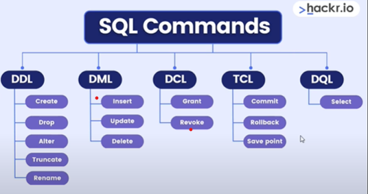

# SQL ve PostgreSQL Öğrenme Roadmap'i

Bu repository SQL ve PostgreSQL öğrenmek isteyenler için kapsamlı roadmap'ler içerir.

## 📚 İçerik

### 🗄️ [SQL Roadmap](./SQL_README.md)

- Basic SQL Syntax
- Data Manipulation Language (DML)
- Data Definition Language (DDL)
- JOIN Queries
- Subqueries
- Aggregate Functions
- Gelişmiş Konular

### 🐘 [PostgreSQL DBA Roadmap](./PostgreSQL_README.md)

- PostgreSQL Temelleri
- Kurulum ve Yapılandırma
- Veritabanı Yönetimi
- Kullanıcı ve Güvenlik Yönetimi
- Performans İzleme ve Ayarlama
- Yedekleme ve Kurtarma
- Replikasyon ve Yüksek Erişilebilirlik
- İzleme ve Logging
- Bakım ve Optimizasyon
- Gelişmiş Konular

## 🖼️ Roadmap Görselleri

Her iki rehber de detaylı roadmap görselleri içerir ve konular "Detayı Görüntüle" formatında düzenlenmiştir.

### SQL Komutları Özet Şeması

SQL'in temel komut kategorileri:

- **DDL (Data Definition Language)**: Veritabanı yapısını tanımlar (CREATE, DROP, ALTER, TRUNCATE, RENAME)
- **DML (Data Manipulation Language)**: Veri işlemleri (INSERT, UPDATE, DELETE)
- **DCL (Data Control Language)**: Erişim kontrolü (GRANT, REVOKE)
- **TCL (Transaction Control Language)**: İşlem kontrolü (COMMIT, ROLLBACK, SAVE POINT)
- **DQL (Data Query Language)**: Veri sorgulama (SELECT)

## 🚀 Nasıl Kullanılır

1. İlk olarak [SQL Roadmap](./SQL_README.md) ile temel SQL bilgilerini öğrenin
2. Ardından [PostgreSQL DBA Roadmap](./PostgreSQL_README.md) ile PostgreSQL ilerleyin.
3. Her konuyu teorik olarak öğrendikten sonra pratik yapın
4. Kod örneklerini çalıştırıp test edin

## 📖 Özellikler

- ✅ Açılır kapanır (collapsible) bölümler
- ✅ Kod örnekleri
- ✅ Hafıza teknikleri
- ✅ Gerçek hayat örnekleri
- ✅ Görsel roadmap'ler

---

**Not**: Bu rehberler teknik konulara odaklanır ve öğretici içerik sunar.
