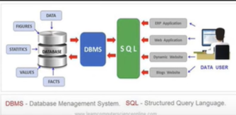

# SQL Öğrenme Roadmap'i

<details>
<summary>🖼️ SQL Roadmap Görselini Görüntüle</summary>




_SQL Roadmap_

</details>

## İçindekiler

- [Basic SQL Syntax](#basic-sql-syntax)
- [Operators (Operatörler)](#operators-operatörler)
- [Data Manipulation Language (DML)](#data-manipulation-language-dml)
- [Data Definition Language (DDL)](#data-definition-language-ddl)
- [Data Constraints (Veri Kısıtlamaları)](#data-constraints-veri-kısıtlamaları)
- [JOIN Queries](#join-queries)
- [Subqueries (Alt Sorgular)](#subqueries-alt-sorgular)
- [Aggregate Queries](#aggregate-queries)
- [Gelişmiş Konular](#gelişmiş-konular)

---

## Basic SQL Syntax

<details>
<summary>📖 Detayı Görüntüle</summary>

### 1. Açıklama

Basic SQL Syntax, SQL dilinin temel yapısını ve komut yazım kurallarını kapsar. SQL komutlarının nasıl yazılacağı, noktalama işaretleri, büyük-küçük harf kullanımı gibi temel konuları içerir.

### 2. Amacı

- SQL komutlarının doğru yazımını öğrenmek
- Syntax hatalarını önlemek
- Okunabilir ve düzenli SQL kodları yazmak
- SQL standartlarına uygun kod geliştirmek

### 3. Özet

SQL komutları noktalı virgülle biter, büyük-küçük harf duyarlı değildir (best practice olarak keywords büyük yazılır), string değerler tek tırnak içinde yazılır.

### 4. Basit Açıklama

SQL'i İngilizce bir cümle gibi düşünün. Özne (SELECT), yüklem (FROM), nesne (tablolar) var. Gramer kuralları gibi SQL'in de yazım kuralları vardır.

### 5. Bu terim neden gerekli?

- Hatasız SQL yazmak için temel
- Kod standartları için gerekli
- Takım çalışmasında anlaşılabilirlik için
- Debugging süreçlerini kolaylaştırmak için

### 6. Örnek

```sql
-- Doğru SQL Syntax
SELECT ad, soyad, yas
FROM kullanicilar
WHERE yas > 18
ORDER BY ad ASC;

-- Yorum satırları
/* Bu çok satırlı
   yorum örneğidir */

-- String kullanımı
SELECT * FROM urunler WHERE kategori = 'Elektronik';

-- Case insensitive (aynı anlamda)
select * from kullanicilar;
SELECT * FROM kullanicilar;
Select * From kullanicilar;
```

### 7. Ezberleme Tekniği

**Gerçek Hayat Örneği**: SQL'i bir restoran siparişi verme süreci gibi düşünün. "Garson (SELECT), menüden (FROM) pizza (koşul) istiyorum" dersiniz. Her dilde gramer kuralları olduğu gibi SQL'de de syntax kuralları var.

**Hafıza Hilesi**:

- **SELECT** = **SEÇ** (Ne istiyorsun?)
- **FROM** = **NEREDEN** (Hangi kaynaktan?)
- **WHERE** = **NEREDE** (Hangi koşulla?)
- **;** = **NOKTA** (Cümleyi bitir)

</details>

---

## Operators (Operatörler)

<details>
<summary>📖 Detayı Görüntüle</summary>

### 1. Açıklama

SQL operatörleri, verileri karşılaştırmak, matematiksel işlemler yapmak ve mantıksal koşullar oluşturmak için kullanılan sembollerdir. Arithmetic, Comparison, Logical ve Special operatörler olmak üzere farklı kategorilerde bulunur.

### 2. Amacı

- Veri filtreleme işlemleri
- Matematiksel hesaplamalar
- Mantıksal koşul oluşturma
- String manipülasyonu

### 3. Özet

Roadmap'teki SELECT, INSERT, DELETE, UPDATE statements bu operatörlerle güçlenir. Comparison (=, >, <), Logical (AND, OR, NOT), Arithmetic (+, -, \*, /) operatörleri vardır.

### 4. Basit Açıklama

Matematik dersindeki işlemler gibi. Toplama (+), çıkarma (-), eşittir (=), büyüktür (>) sembollerini SQL'de de kullanıyorsunuz.

### 5. Bu terim neden gerekli?

- Karmaşık sorgular yazabilmek için
- Verileri filtreleyebilmek için
- Hesaplanmış sütunlar oluşturmak için
- Koşullu mantık kurmak için

### 6. Örnek

```sql
-- Arithmetic Operators
SELECT
    urun_adi,
    fiyat,
    fiyat * 1.18 AS kdv_dahil_fiyat,
    fiyat - (fiyat * 0.10) AS indirimli_fiyat
FROM urunler;

-- Comparison Operators
SELECT * FROM calisanlar WHERE maas > 5000;
SELECT * FROM calisanlar WHERE departman = 'IT';
SELECT * FROM calisanlar WHERE yas BETWEEN 25 AND 40;

-- Logical Operators
SELECT * FROM urunler
WHERE kategori = 'Elektronik'
AND fiyat > 1000
AND stok_miktari > 0;

-- String Operators
SELECT * FROM kullanicilar WHERE ad LIKE 'Ah%';
SELECT * FROM kullanicilar WHERE email LIKE '%@gmail.com';

-- IN Operator
SELECT * FROM urunler WHERE kategori IN ('Elektronik', 'Bilgisayar', 'Telefon');

-- NULL Operators
SELECT * FROM calisanlar WHERE telefon IS NOT NULL;
SELECT * FROM calisanlar WHERE bonus IS NULL;
```

### 7. Ezberleme Tekniği

**Gerçek Hayat Örneği**: Market alışverişi yaparken karar verme süreci gibi. "Fiyatı 100 TL'den az VE markası Samsung VEYA Apple olan telefonları getir" diyorsunuz.

**Hafıza Hilesi**:

- **AND** = **VE** (her iki koşul da doğru olmalı)
- **OR** = **VEYA** (koşullardan biri doğru olmalı)
- **NOT** = **DEĞİL** (koşulun tersi)
- **LIKE** = **BENZERİ** (pattern matching)

</details>

---

## Data Manipulation Language (DML)

<details>
<summary>📖 Detayı Görüntüle</summary>

### 1. Açıklama

DML (Data Manipulation Language), veritabanındaki verileri manipüle etmek için kullanılan SQL komutlarıdır. SELECT, INSERT, UPDATE, DELETE komutlarını içerir ve roadmap'te ana DML bloğunda gösterilmiştir.

### 2. Amacı

- Veritabanından veri çekme (SELECT)
- Yeni veri ekleme (INSERT)
- Mevcut veri güncelleme (UPDATE)
- Veri silme (DELETE)

### 3. Özet

CRUD (Create, Read, Update, Delete) işlemlerinin SQL karşılığıdır. FROM, WHERE, JOINs, GROUP BY, ORDER BY, HAVING klauzülleri ile güçlendirilir.

### 4. Basit Açıklama

Bir not defteri kullanmak gibi. Yeni not yazarsınız (INSERT), notları okursunuz (SELECT), düzenlersiniz (UPDATE), silersiniz (DELETE).

### 5. Bu terim neden gerekli?

- Dinamik uygulamalar için zorunlu
- Veri yönetimi için temel
- User interactions için gerekli
- Business logic implementation için

### 6. Örnek

```sql
-- SELECT - Veri Çekme
SELECT
    k.ad,
    k.soyad,
    k.email
FROM kullanicilar k
WHERE k.aktif = true
ORDER BY k.kayit_tarihi DESC;

-- SELECT with JOINs
SELECT
    k.ad,
    COUNT(s.id) as siparis_sayisi
FROM kullanicilar k
LEFT JOIN siparisler s ON k.id = s.kullanici_id
GROUP BY k.id, k.ad
HAVING COUNT(s.id) > 0;

-- INSERT - Veri Ekleme
INSERT INTO kullanicilar (ad, soyad, email, telefon)
VALUES ('Ahmet', 'Yılmaz', 'ahmet@email.com', '5551234567');

-- Multiple INSERT
INSERT INTO urunler (ad, fiyat, kategori_id) VALUES
    ('Laptop', 15000, 1),
    ('Mouse', 50, 2),
    ('Klavye', 200, 2);

-- UPDATE - Veri Güncelleme
UPDATE kullanicilar
SET
    telefon = '5559876543',
    guncelleme_tarihi = CURRENT_TIMESTAMP
WHERE email = 'ahmet@email.com';

-- DELETE - Veri Silme
DELETE FROM kullanicilar
WHERE aktif = false
AND son_giris < '2023-01-01';

-- Conditional DELETE
DELETE FROM sepet_urunleri
WHERE sepet_id IN (
    SELECT id FROM sepetler
    WHERE olusturma_tarihi < NOW() - INTERVAL '30 days'
);
```

### 7. Ezberleme Tekniği

**Gerçek Hayat Örneği**: Bir kütüphane sistemi gibi. Kitap kataloguna bakarsınız (SELECT), yeni kitap kaydedersiniz (INSERT), kitap bilgilerini güncellersiniz (UPDATE), eski kitapları arşivden çıkarırsınız (DELETE).

**Hafıza Hilesi**:

- **SELECT** = **SEÇ** (göster bana)
- **INSERT** = **SOKMA** (yeni ekle)
- **UPDATE** = **GÜNCELLE** (var olanı değiştir)
- **DELETE** = **SİL** (kaldır)

</details>

---

## Data Definition Language (DDL)

<details>
<summary>📖 Detayı Görüntüle</summary>

### 1. Açıklama

DDL (Data Definition Language), veritabanı yapısını tanımlayan komutlardır. Roadmap'te gösterilen Create Table, Alter Table, Drop Table, Truncate Table işlemlerini kapsar.

### 2. Amacı

- Veritabanı şemasını oluşturma
- Tablo yapılarını tanımlama
- Veritabanı objelerini yönetme
- Schema değişikliklerini uygulama

### 3. Özet

CREATE, ALTER, DROP, TRUNCATE komutları ile tablolar, indeksler, constraint'ler yönetilir. Veritabanının iskeletini oluşturan komutlardır.

### 4. Basit Açıklama

Bir ev inşa etmek gibi. Temel atarsınız (CREATE), oda eklersiniz (ALTER), gereksiz bölümleri kaldırırsınız (DROP), evi boşaltırsınız (TRUNCATE).

### 5. Bu terim neden gerekli?

- Veritabanı tasarımı için temel
- Schema management için zorunlu
- Veri bütünlüğü için kritik
- System evolution için gerekli

### 6. Örnek

```sql
-- CREATE TABLE - Tablo Oluşturma
CREATE TABLE kullanicilar (
    id SERIAL PRIMARY KEY,
    ad VARCHAR(50) NOT NULL,
    soyad VARCHAR(50) NOT NULL,
    email VARCHAR(100) UNIQUE NOT NULL,
    telefon VARCHAR(15),
    dogum_tarihi DATE,
    kayit_tarihi TIMESTAMP DEFAULT CURRENT_TIMESTAMP,
    aktif BOOLEAN DEFAULT true
);

-- CREATE TABLE with Foreign Key
CREATE TABLE siparisler (
    id SERIAL PRIMARY KEY,
    kullanici_id INTEGER REFERENCES kullanicilar(id),
    siparis_tarihi TIMESTAMP DEFAULT CURRENT_TIMESTAMP,
    toplam_tutar DECIMAL(10,2) NOT NULL,
    durum VARCHAR(20) DEFAULT 'beklemede'
);

-- ALTER TABLE - Tablo Değiştirme
ALTER TABLE kullanicilar
ADD COLUMN son_giris_tarihi TIMESTAMP;

ALTER TABLE kullanicilar
ALTER COLUMN telefon SET NOT NULL;

ALTER TABLE kullanicilar
DROP COLUMN dogum_tarihi;

-- DROP TABLE - Tablo Silme
DROP TABLE IF EXISTS temp_veriler;

DROP TABLE eski_log_kayitlari CASCADE;

-- TRUNCATE TABLE - Tablo İçeriği Temizleme
TRUNCATE TABLE sepet_urunleri;

TRUNCATE TABLE log_kayitlari RESTART IDENTITY;

-- CREATE INDEX
CREATE INDEX idx_kullanici_email ON kullanicilar(email);
CREATE INDEX idx_siparis_tarih ON siparisler(siparis_tarihi);

-- CREATE SEQUENCE
CREATE SEQUENCE siparis_no_seq START 1000;
```

### 7. Ezberleme Tekniği

**Gerçek Hayat Örneği**: Bir şirket binası inşa etmek gibi. Binanın planını çizersiniz (CREATE), yeni katlar eklersiniz (ALTER), gereksiz bölümleri yıkarsınız (DROP), ofisleri boşaltırsınız (TRUNCATE).

**Hafıza Hilesi**:

- **CREATE** = **YARAT** (sıfırdan oluştur)
- **ALTER** = **DEĞİŞTİR** (var olanı modifiye et)
- **DROP** = **BIRAK** (tamamen kaldır)
- **TRUNCATE** = **KES** (içeriği temizle)

</details>

---

## Data Constraints (Veri Kısıtlamaları)

<details>
<summary>📖 Detayı Görüntüle</summary>

### 1. Açıklama

Data Constraints, veritabanına girilen verilerin belirli kuralları karşılamasını sağlayan kısıtlamalardır. Roadmap'te Primary Key, Foreign Key, Unique, NOT NULL, CHECK constraint'leri gösterilmiştir.

### 2. Amacı

- Veri bütünlüğünü sağlama
- İş kurallarını enforce etme
- Hatalı veri girişini önleme
- Referential integrity sağlama

### 3. Özet

Constraints, tablolara uygulanan kurallar olup veri kalitesini garanti eder. Primary key benzersizlik, foreign key ilişkileri korur.

### 4. Basit Açıklama

Bir apartman yönetmeliği gibi. Her dairenin numarası benzersiz olmalı (Primary Key), ziyaretçiler kayıtlı olmalı (Foreign Key), isim alanı boş bırakılamaz (NOT NULL).

### 5. Bu terim neden gerekli?

- Veri kalitesi için kritik
- İş kuralları için zorunlu
- Database integrity için
- Hata önleme için

### 6. Örnek

```sql
-- PRIMARY KEY Constraint
CREATE TABLE departmanlar (
    id SERIAL PRIMARY KEY,
    ad VARCHAR(50) NOT NULL UNIQUE,
    aciklama TEXT
);

-- FOREIGN KEY Constraint
CREATE TABLE calisanlar (
    id SERIAL PRIMARY KEY,
    ad VARCHAR(50) NOT NULL,
    soyad VARCHAR(50) NOT NULL,
    email VARCHAR(100) UNIQUE NOT NULL,
    maas DECIMAL(10,2),
    departman_id INTEGER,
    CONSTRAINT fk_departman
        FOREIGN KEY (departman_id)
        REFERENCES departmanlar(id)
        ON DELETE SET NULL
        ON UPDATE CASCADE
);

-- UNIQUE Constraint
ALTER TABLE calisanlar
ADD CONSTRAINT uk_calisan_email UNIQUE (email);

-- NOT NULL Constraint
ALTER TABLE calisanlar
ALTER COLUMN ad SET NOT NULL;

-- CHECK Constraint
ALTER TABLE calisanlar
ADD CONSTRAINT chk_maas_pozitif
CHECK (maas > 0);

ALTER TABLE calisanlar
ADD CONSTRAINT chk_email_format
CHECK (email LIKE '%@%.%');

-- Multiple Column Constraint
CREATE TABLE proje_atamalari (
    calisan_id INTEGER,
    proje_id INTEGER,
    baslangic_tarihi DATE NOT NULL,
    PRIMARY KEY (calisan_id, proje_id),
    FOREIGN KEY (calisan_id) REFERENCES calisanlar(id),
    FOREIGN KEY (proje_id) REFERENCES projeler(id)
);

-- Constraint Drop
ALTER TABLE calisanlar
DROP CONSTRAINT chk_maas_pozitif;
```

### 7. Ezberleme Tekniği

**Gerçek Hayat Örneği**: Okul kayıt sistemi gibi. Her öğrencinin numarası benzersiz (Primary Key), sınıf bilgisi mevcut sınıflardan biri olmalı (Foreign Key), ad-soyad boş olamaz (NOT NULL), yaş 18+ olmalı (CHECK).

**Hafıza Hilesi**:

- **PRIMARY KEY** = **ANA ANAHTAR** (benzersiz kimlik)
- **FOREIGN KEY** = **YABANCI ANAHTAR** (başka tabloya referans)
- **UNIQUE** = **EŞSİZ** (tekrar edemez)
- **NOT NULL** = **BOŞ OLAMAZ** (değer zorunlu)
- **CHECK** = **KONTROL** (kurala uymalı)

</details>

---

## JOIN Queries

<details>
<summary>📖 Detayı Görüntüle</summary>

### 1. Açıklama

JOIN Queries, iki veya daha fazla tabloyu birleştirerek tek bir sonuç kümesi elde etmek için kullanılır. Roadmap'te INNER JOIN, LEFT JOIN ve diğer JOIN türleri gösterilmiştir.

### 2. Amacı

- İlişkili verileri birleştirme
- Normalizasyonun faydalarını koruma
- Karmaşık raporlar oluşturma
- İlişkisel veritabanı avantajları

### 3. Özet

INNER JOIN ortak kayıtları, LEFT JOIN sol tablodaki tüm kayıtları getirir. JOIN türleri farklı senaryolarda kullanılır.

### 4. Basit Açıklama

İki farklı dosyayı ortak bir bilgiye göre birleştirmek gibi. Müşteri listesi ve sipariş listesini müşteri ID'sine göre eşleştiriyorsunuz.

### 5. Bu terim neden gerekli?

- İlişkisel veritabanı için temel
- Veri normalizasyonu için
- Comprehensive reporting için
- Data analysis için

### 6. Örnek

```sql
-- INNER JOIN - Ortak kayıtlar
SELECT
    k.ad,
    k.soyad,
    s.siparis_tarihi,
    s.toplam_tutar
FROM kullanicilar k
INNER JOIN siparisler s ON k.id = s.kullanici_id
WHERE s.siparis_tarihi >= '2023-01-01';

-- LEFT JOIN - Sol tablodaki tüm kayıtlar
SELECT
    k.ad,
    k.soyad,
    COUNT(s.id) as siparis_sayisi,
    COALESCE(SUM(s.toplam_tutar), 0) as toplam_harcama
FROM kullanicilar k
LEFT JOIN siparisler s ON k.id = s.kullanici_id
GROUP BY k.id, k.ad, k.soyad
ORDER BY toplam_harcama DESC;

-- RIGHT JOIN - Sağ tablodaki tüm kayıtlar
SELECT
    k.ad,
    s.siparis_tarihi,
    s.toplam_tutar
FROM kullanicilar k
RIGHT JOIN siparisler s ON k.id = s.kullanici_id;

-- FULL OUTER JOIN - Her iki tablodaki tüm kayıtlar
SELECT
    k.ad,
    s.siparis_tarihi
FROM kullanicilar k
FULL OUTER JOIN siparisler s ON k.id = s.kullanici_id;

-- SELF JOIN - Aynı tabloyu kendisiyle join
SELECT
    c1.ad as calisan,
    c2.ad as yonetici
FROM calisanlar c1
LEFT JOIN calisanlar c2 ON c1.yonetici_id = c2.id;

-- Multiple JOINs
SELECT
    k.ad,
    s.siparis_tarihi,
    u.urun_adi,
    sd.miktar,
    u.fiyat
FROM kullanicilar k
JOIN siparisler s ON k.id = s.kullanici_id
JOIN siparis_detaylari sd ON s.id = sd.siparis_id
JOIN urunler u ON sd.urun_id = u.id
WHERE s.siparis_tarihi >= '2023-01-01';
```

### 7. Ezberleme Tekniği

**Gerçek Hayat Örneği**: Düğün organizasyonu gibi. Davetiye listesi ve masa planını misafir ID'sine göre birleştiriyorsunuz. Inner join: hem davetiyesi hem masası olan, Left join: davetiyesi olan herkes (masası olmasa da).

**Hafıza Hilesi**:

- **INNER JOIN** = **İÇ KAVŞAK** (ortaklar)
- **LEFT JOIN** = **SOL TAM** (soldaki herkes)
- **RIGHT JOIN** = **SAĞ TAM** (sağdaki herkes)
- **FULL OUTER JOIN** = **HERKES** (her iki taraf)

</details>

---

## Subqueries (Alt Sorgular)

<details>
<summary>📖 Detayı Görüntüle</summary>

### 1. Açıklama

Subqueries, bir SQL sorgusunun içinde yer alan başka bir SQL sorgusudur. Roadmap'te Nested Subqueries ve Correlated Subqueries olarak ikiye ayrılmıştır.

### 2. Amacı

- Karmaşık filtreleme
- Dinamik koşullar oluşturma
- Çok aşamalı veri analizi
- Temporary result sets

### 3. Özet

WHERE, SELECT, FROM klauzüllerinde kullanılabilir. Nested (bağımsız) ve Correlated (bağımlı) olmak üzere iki türü vardır.

### 4. Basit Açıklama

Matruşka bebek gibi içiçe sorular. "Ortalamadan yüksek maaş alanları bul" derken, önce ortalamayı hesaplıyor, sonra onunla karşılaştırıyor.

### 5. Bu terim neden gerekli?

- Karmaşık business logic için
- Multi-step analysis için
- Dynamic filtering için
- Advanced SQL için

### 6. Örnek

```sql
-- Nested Subquery (WHERE'de)
SELECT ad, maas
FROM calisanlar
WHERE maas > (
    SELECT AVG(maas)
    FROM calisanlar
);

-- Subquery with IN
SELECT ad, soyad
FROM kullanicilar
WHERE id IN (
    SELECT DISTINCT kullanici_id
    FROM siparisler
    WHERE siparis_tarihi >= '2023-01-01'
);

-- Subquery with EXISTS
SELECT k.ad, k.email
FROM kullanicilar k
WHERE EXISTS (
    SELECT 1
    FROM siparisler s
    WHERE s.kullanici_id = k.id
    AND s.toplam_tutar > 1000
);

-- Correlated Subquery
SELECT
    c1.ad,
    c1.maas,
    c1.departman_id
FROM calisanlar c1
WHERE c1.maas > (
    SELECT AVG(c2.maas)
    FROM calisanlar c2
    WHERE c2.departman_id = c1.departman_id
);

-- Subquery in SELECT
SELECT
    k.ad,
    k.email,
    (SELECT COUNT(*)
     FROM siparisler s
     WHERE s.kullanici_id = k.id) as siparis_sayisi
FROM kullanicilar k;

-- Subquery in FROM (Derived Table)
SELECT
    dept_adi,
    ortalama_maas
FROM (
    SELECT
        d.ad as dept_adi,
        AVG(c.maas) as ortalama_maas
    FROM calisanlar c
    JOIN departmanlar d ON c.departman_id = d.id
    GROUP BY d.id, d.ad
) as dept_stats
WHERE ortalama_maas > 7000;
```

### 7. Ezberleme Tekniği

**Gerçek Hayat Örneği**: Bir sınıfta "sınıf ortalamasından yüksek not alan öğrencileri bul" demek gibi. Önce sınıf ortalamasını hesaplıyorsunuz (inner query), sonra o değerden yüksek olanları buluyorsunuz (outer query).

**Hafıza Hilesi**:

- **NESTED** = **YUVALANMIŞ** (bağımsız çalışır)
- **CORRELATED** = **İLİŞKİLİ** (dış sorguya bağımlı)
- **EXISTS** = **VAR MI?** (böyle kayıt var mı kontrol et)
- **IN** = **İÇİNDE Mİ?** (bu listede var mı?)

</details>

---

## Aggregate Queries

<details>
<summary>📖 Detayı Görüntüle</summary>

### 1. Açıklama

Aggregate Queries, birden fazla satırdaki verileri tek bir değere dönüştüren fonksiyonları kullanır. Roadmap'te SUM, COUNT, AVG, MIN, MAX fonksiyonları ve GROUP BY, HAVING klauzülleri gösterilmiştir.

### 2. Amacı

- Veri özetleme ve analiz
- İstatistiksel hesaplamalar
- Raporlama için toplam değerler
- Business intelligence

### 3. Özet

GROUP BY ile veriler gruplandırılır, HAVING ile gruplar filtrelenir. COUNT, SUM, AVG, MIN, MAX gibi aggregate functions kullanılır.

### 4. Basit Açıklama

Bir sınıftaki öğrencilerin notlarını özetlemek gibi. Kaç öğrenci var (COUNT), ortalama not (AVG), en yüksek not (MAX), toplam puan (SUM).

### 5. Bu terim neden gerekli?

- Business analytics için temel
- Reporting için zorunlu
- KPI calculations için
- Data summarization için

### 6. Örnek

```sql
-- Temel Aggregate Functions
SELECT
    COUNT(*) as toplam_calisan,
    AVG(maas) as ortalama_maas,
    MIN(maas) as en_dusuk_maas,
    MAX(maas) as en_yuksek_maas,
    SUM(maas) as toplam_maas_gideri
FROM calisanlar;

-- GROUP BY ile gruplama
SELECT
    departman_id,
    COUNT(*) as calisan_sayisi,
    AVG(maas) as ortalama_maas,
    MAX(maas) as en_yuksek_maas
FROM calisanlar
GROUP BY departman_id
ORDER BY ortalama_maas DESC;

-- HAVING ile grup filtreleme
SELECT
    departman_id,
    COUNT(*) as calisan_sayisi,
    AVG(maas) as ortalama_maas
FROM calisanlar
GROUP BY departman_id
HAVING COUNT(*) > 5
AND AVG(maas) > 6000;

-- Multiple grouping columns
SELECT
    departman_id,
    pozisyon,
    COUNT(*) as kisi_sayisi,
    AVG(maas) as ortalama_maas
FROM calisanlar
GROUP BY departman_id, pozisyon
ORDER BY departman_id, ortalama_maas DESC;

-- Aggregate with JOIN
SELECT
    d.ad as departman_adi,
    COUNT(c.id) as calisan_sayisi,
    COALESCE(AVG(c.maas), 0) as ortalama_maas,
    COALESCE(SUM(c.maas), 0) as toplam_maas_gideri
FROM departmanlar d
LEFT JOIN calisanlar c ON d.id = c.departman_id
GROUP BY d.id, d.ad
ORDER BY calisan_sayisi DESC;

-- Date-based aggregation
SELECT
    DATE_TRUNC('month', siparis_tarihi) as ay,
    COUNT(*) as siparis_sayisi,
    SUM(toplam_tutar) as aylik_ciro,
    AVG(toplam_tutar) as ortalama_siparis_tutari
FROM siparisler
WHERE siparis_tarihi >= '2023-01-01'
GROUP BY DATE_TRUNC('month', siparis_tarihi)
ORDER BY ay;

-- Conditional aggregation
SELECT
    departman_id,
    COUNT(*) as toplam_calisan,
    COUNT(CASE WHEN maas > 8000 THEN 1 END) as yuksek_maasli,
    COUNT(CASE WHEN maas <= 8000 THEN 1 END) as normal_maasli,
    AVG(CASE WHEN pozisyon = 'Senior' THEN maas END) as senior_ortalama_maas
FROM calisanlar
GROUP BY departman_id;
```

### 7. Ezberleme Tekniği

**Gerçek Hayat Örneği**: Bir mağaza müdürü günlük rapor hazırlıyor. Kaç müşteri geldi (COUNT), ortalama alışveriş tutarı (AVG), en büyük alışveriş (MAX), günlük toplam satış (SUM).

**Hafıza Hilesi**:

- **COUNT** = **SAY** (kaç tane?)
- **SUM** = **TOPLA** (hepsini topla)
- **AVG** = **AVERAGE** (ortalama)
- **GROUP BY** = **GRUPLA** (kategorilere ayır)
- **HAVING** = **GRUP KOŞULU** (gruplar için WHERE)

</details>

---

## Gelişmiş Konular

<details>
<summary>📖 Detayı Görüntüle</summary>

### 1. Açıklama

SQL'in ileri düzey konularını kapsar: Window Functions, CTEs (Common Table Expressions), Views, Stored Procedures, Triggers, Indexes ve Performance Optimization.

### 2. Amacı

- Karmaşık analitik sorgular yazma
- Code reusability sağlama
- Performance optimization
- Advanced database features

### 3. Özet

Bu konular SQL'de uzmanlaşmak isteyen geliştiriciler için kritiktir. Enterprise uygulamalarda sıkça kullanılır.

### 4. Basit Açıklama

Temel SQL'i öğrendikten sonra, profesyonel projelerde kullanılan gelişmiş araçları öğrenmek gibi. Temel hesap makinasından bilimsel hesap makinasına geçmek.

### 5. Bu terim neden gerekli?

- Senior developer olmak için
- Complex business requirements için
- Performance critical applications için
- Enterprise solutions için

### 6. Örnek

```sql
-- Window Functions
SELECT
    ad,
    departman_id,
    maas,
    AVG(maas) OVER (PARTITION BY departman_id) as dept_ortalama,
    ROW_NUMBER() OVER (PARTITION BY departman_id ORDER BY maas DESC) as dept_siralama,
    RANK() OVER (ORDER BY maas DESC) as genel_siralama
FROM calisanlar;

-- Common Table Expression (CTE)
WITH departman_istatistikleri AS (
    SELECT
        departman_id,
        COUNT(*) as calisan_sayisi,
        AVG(maas) as ortalama_maas
    FROM calisanlar
    GROUP BY departman_id
),
yuksek_performansli_deptler AS (
    SELECT departman_id
    FROM departman_istatistikleri
    WHERE calisan_sayisi > 10 AND ortalama_maas > 7000
)
SELECT
    c.ad,
    c.soyad,
    c.maas,
    d.ad as departman_adi
FROM calisanlar c
JOIN departmanlar d ON c.departman_id = d.id
WHERE c.departman_id IN (SELECT departman_id FROM yuksek_performansli_deptler);

-- Recursive CTE (Hierarşik data)
WITH RECURSIVE org_chart AS (
    -- Base case: Top level managers
    SELECT id, ad, yonetici_id, 1 as level
    FROM calisanlar
    WHERE yonetici_id IS NULL

    UNION ALL

    -- Recursive case
    SELECT c.id, c.ad, c.yonetici_id, oc.level + 1
    FROM calisanlar c
    JOIN org_chart oc ON c.yonetici_id = oc.id
)
SELECT * FROM org_chart ORDER BY level, ad;

-- View oluşturma
CREATE VIEW aktif_calisan_ozeti AS
SELECT
    c.id,
    c.ad,
    c.soyad,
    d.ad as departman,
    c.maas,
    c.baslangic_tarihi
FROM calisanlar c
JOIN departmanlar d ON c.departman_id = d.id
WHERE c.aktif = true;

-- View kullanımı
SELECT * FROM aktif_calisan_ozeti
WHERE departman = 'IT'
ORDER BY maas DESC;

-- Index oluşturma
CREATE INDEX idx_calisan_departman ON calisanlar(departman_id);
CREATE INDEX idx_siparis_tarih_kullanici ON siparisler(siparis_tarihi, kullanici_id);

-- Composite index
CREATE INDEX idx_calisan_dept_maas ON calisanlar(departman_id, maas DESC);

-- Partial index
CREATE INDEX idx_aktif_calisanlar ON calisanlar(ad, soyad) WHERE aktif = true;
```

### 7. Ezberleme Tekniği

**Gerçek Hayat Örneği**: Temel araba kullanmayı öğrendikten sonra, park sensörü, navigasyon, cruise control gibi gelişmiş özellikleri öğrenmek. Aynı araç ama çok daha güçlü kullanım.

**Hafıza Hilesi**:

- **WINDOW FUNCTION** = **PENCERE FONKSİYONU** (pencereden bakarak hesapla)
- **CTE** = **COMMON TABLE EXPRESSION** (ortak tablo ifadesi, geçici sonuç)
- **VIEW** = **GÖRÜNÜM** (sanal tablo)
- **INDEX** = **DİZİN** (hızlı erişim için işaretçi)

</details>
